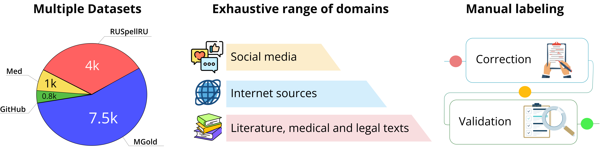

🐙 GitHubTypoCorpusRu
-------------------

The dataset is a part of `spellcheck_punctuation_benchmark <https://huggingface.co/datasets/ai-forever/spellcheck_punctuation_benchmark>`_:

The Benchmark includes four datasets, each of which consists of pairs of sentences in Russian language. Each pair embodies sentence, which may contain spelling and punctuation errors, and its corresponding correction. Datasets were gathered from various sources and domains including social networks, internet blogs, github commits, medical anamnesis, literature, news, reviews and more.

All datasets were passed through two-stage manual labeling pipeline. The correction of a sentence is defined by an agreement of at least two human annotators. Manual labeling scheme accounts for jargonisms, collocations and common language, hence in some cases it encourages annotators not to amend a word in favor of preserving style of a text.

The latter does not apply to punctuation. Punctuation signs are rigorously marked in accordance to the rules of the Russian punctuation system.

Table of contents
^^^^^^^^^^^^^^^^^

* `Dataset description <#id1>`_

  * `Dataset summary <#id2>`_
  * `Supported Tasks and Leaderboards <#id3>`_
  * `Languages <#id4>`_

* `Dataset Structure <#id5>`_

  * `Data Instances <#id6>`_
  * `Data Fields <#id7>`_
  * `Data Splits <#id8>`_

* `Dataset Creation <#id9>`_
  * `Initial Data Collection and Normalization <#id10>`_
  * `Annotation process <#id11>`_
  * `Who are the annotators? <#id12>`_

* `Considerations for Using the Data <#id913>`_

  * `Discussion of Biases <#id14>`_
  * `Other Known Limitations <#id15>`_

* `Additional Information <#id16>`_

  * `Future plans <#id17>`_
  * `Dataset Curators <#id18>`_
  * `Licensing Information <#id19>`_
  * `Citation Information <#id20>`_

Dataset Description
^^^^^^^^^^^^^^^^^^^

- **Repository:** `SAGE <https://github.com/ai-forever/sage>`_
- **Paper:** `EACL 2024 <https://aclanthology.org/2024.findings-eacl.10/>`_
- **Point of Contact:** nikita.martynov.98@list.ru

Dataset Summary
################

The Russian language part of `GitHub Typo Corpus <https://aclanthology.org/2020.lrec-1.835/>`_.
The texts are from GitHub commits. Passed the second-step of two-step manual annotation.

Supported Tasks and Leaderboards
#################################

- **Task:** automatic spelling correction.
- **Metrics:** https://www.dialog-21.ru/media/3427/sorokinaaetal.pdf.
- **ERRANT:** https://github.com/chrisjbryant/errant.

Languages
#########

Russian.

Dataset Structure
^^^^^^^^^^^^^^^^^

Data Instances
################

- **Size of downloaded dataset files:** 1.23 Mb
- **Size of the generated dataset:** 0.48 Mb
- **Total amount of disk used:** 1.71 Mb

An example of "test" looks as follows

.. code-block::

    {
        "source": "text: Пожалуйста выберите чат, чтобы начать общение",
        "correction": "text: Пожалуйста, выберите чат, чтобы начать общение.",
    }

Data Fields
################

- `source`: a `string` feature
- `correction`: a `string` feature
- `domain`: a `string` feature

Data Splits
################

+--------------------+------+
|                    | test |
+====================+======+
| GitHubTypoCorpusRu | 868  |
+--------------------+------+

Dataset Creation
^^^^^^^^^^^^^^^^^

Initial Data Collection and Normalization
##########################################

For the reference on the original data collection please see the `paper <https://aclanthology.org/2020.lrec-1.835/>`_.
We extracted the Russian part from the original corpus and passed the texts trough the second step of two-stage manual annotation.

Annotation process
##########################################

We set up two-stage annotation project via a crowd-sourcing platform Toloka:

1. Data gathering stage: we provide the texts with possible mistakes to annotators and ask them to write the sentence correctly;
2. Validation stage: we provide annotators with the pair of sentences (source and its corresponding correction from the previous stage) and ask them to check if the correction is right.

We prepared instructions for annotators for each task. The instructions ask annotators to correct misspellings if it does not alter the original style of the text.
Instructions do not provide rigorous criteria on the matter of distinguishing the nature of an error in terms of its origin - whether it came from an urge to endow a sentence with particular stylistic features or from unintentional spelling violation since it is time-consuming and laborious to describe every possible case of employing slang, dialect, colloquialisms, etc. instead of proper language. Instructions also do not distinguish errors that come from the geographical or social background of the source. Instead, we rely on annotators’ knowledge and understanding of a language since, in this work, the important factor is to preserve the original style of the text.
To ensure we receive qualified expertise, we set up test iteration on a small subset of the data for both stages. We manually validated the test results and selected annotators, who processed at least six samples (2% of the total test iteration) and did not make a single error. After test iteration, we cut 85% and 86% of labellers for gathering and validation stages.
We especially urge annotators to correct mistakes associated with the substitution of the letters "ё" "й" and "щ" for corresponding "е" "и" and "ш" and not to explain abbreviations and correct punctuation errors. Each annotator is also warned about potentially sensitive topics in data (e.g., politics, societal minorities, and religion).

The annotation of punctuation errors has been done in one iteration considering the low variation and difficulty of the task (relative to spelling correction). The annotators have been asked to correct punctuation signs in accordance with the rules of the Russian punctuation system.

Who are the annotators?
########################

Native Russian speakers who passed the language exam.

The annotators for punctuation errors are also professional editors and linguists.

Considerations for Using the Data
^^^^^^^^^^^^^^^^^^^^^^^^^^^^^^^^^^

Discussion of Biases
#####################

We clearly state our work’s aims and
implications, making it open source and transparent. The data will be available under a public license. As our research involved anonymized textual data, informed consent from human participants was not required. However, we obtained permission to access publicly available datasets and
ensured compliance with any applicable terms of
service or usage policies.

Other Known Limitations
########################

The data used in our research may be limited to specific
domains, preventing comprehensive coverage of
all possible text variations. Despite these limitations, we tried to address the issue of data diversity
by incorporating single-domain and multi-domain
datasets in the proposed research. This approach
allowed us to shed light on the diversity and variances within the data, providing valuable insights
despite the inherent constraints.

We primarily focus on the Russian language. Further
research is needed to expand the datasets for a wider
range of languages.

Additional Information
^^^^^^^^^^^^^^^^^^^^^^^^

Future plans
###############

We are planning to expand our benchmark with both new Russian datasets and datasets in other languages including (but not limited to) European and CIS languages.
If you would like to contribute, please contact us.

Dataset Curators
###################

Nikita Martynov nikita.martynov.98@list.ru (Spellcheck Punctuation Benchmark)

Licensing Information
######################

All our datasets are published by MIT License.

Citation Information
#######################

.. code-block::

    @inproceedings{martynov2023augmentation,
      title={Augmentation methods for spelling corruptions},
      author={Martynov, Nikita and Baushenko, Mark and Abramov, Alexander and Fenogenova, Alena},
      booktitle={Proceedings of the International Conference “Dialogue},
      volume={2023},
      year={2023}
    }

    @inproceedings{martynov-etal-2024-methodology,
        title = "A Methodology for Generative Spelling Correction via Natural Spelling Errors Emulation across Multiple Domains and Languages",
        author = "Martynov, Nikita  and
          Baushenko, Mark  and
          Kozlova, Anastasia  and
          Kolomeytseva, Katerina  and
          Abramov, Aleksandr  and
          Fenogenova, Alena",
        editor = "Graham, Yvette  and
          Purver, Matthew",
        booktitle = "Findings of the Association for Computational Linguistics: EACL 2024",
        month = mar,
        year = "2024",
        address = "St. Julian{'}s, Malta",
        publisher = "Association for Computational Linguistics",
        url = "https://aclanthology.org/2024.findings-eacl.10",
        pages = "138--155",
        abstract = "Large language models excel in text generation and generalization, however they face challenges in text editing tasks, especially in correcting spelling errors and mistyping.In this paper, we present a methodology for generative spelling correction (SC), tested on English and Russian languages and potentially can be extended to any language with minor changes. Our research mainly focuses on exploring natural spelling errors and mistyping in texts and studying how those errors can be emulated in correct sentences to enrich generative models{'} pre-train procedure effectively. We investigate the effects of emulations in various text domains and examine two spelling corruption techniques: 1) first one mimics human behavior when making a mistake through leveraging statistics of errors from a particular dataset, and 2) second adds the most common spelling errors, keyboard miss clicks, and some heuristics within the texts.We conducted experiments employing various corruption strategies, models{'} architectures, and sizes in the pre-training and fine-tuning stages and evaluated the models using single-domain and multi-domain test sets. As a practical outcome of our work, we introduce SAGE (Spell checking via Augmentation and Generative distribution Emulation).",
    }

