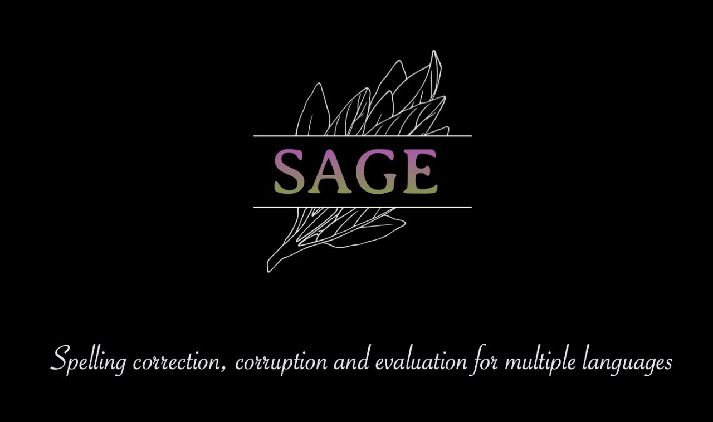

🎯 sage-mt5-large
-------------------

The model is a part of `SAGE v1.1.0 release <https://huggingface.co/collections/ai-forever/sage-v110-release-660abac12d0769b9c67be501>`_

The model corrects spelling errors and typos in both Russian and English languages by bringing all the words in the text to the norm of the language.
Corrector had been trained based on the model `mT5-large <https://huggingface.co/google/mt5-large>`_ architecture.
An extensive dataset with “artificial” errors was taken as a training corpus: the corpus was assembled on the basis of the Russian-language Wikipedia and transcripts of Russian-language videos, then typos and spelling errors were automatically introduced into it using the library `SAGE library <https://github.com/ai-forever/sage>`_.

Table of contents
^^^^^^^^^^^^^^^^^

* `Public references <#id1>`_
* `Examples <#id2>`_
* `Metrics <#id3>`_
* `How to use <#id4>`_
* `API <#id5>`_
* `Limitations <#id6>`_
* `Resources <#id7>`_
* `License <#id10>`_
* `Specifications <#id12>`_
* `Contacts <#id13>`_

Public references
^^^^^^^^^^^^^^^^^

- `SAGE library announcement <https://youtu.be/yFfkV0Qjuu0>`_, DataFest 2023
- `Paper about synthetic error generation methods <https://www.dialog-21.ru/media/5914/martynovnplusetal056.pdf>`_, Dialogue 2023
- `EACL 2024 paper <https://aclanthology.org/2024.findings-eacl.10/>`_

Examples
^^^^^^^^^

+--------------------------------------------------------------------+--------------------------------------------------------------------------+
| Input                                                              | Output                                                                   |
+====================================================================+==========================================================================+
| Перведи мне текст на аглиском: "Screw you kuys, I am goin hme (c). | Переведи мне текст на английском: "Screw you guys, I am going home" (c). |
+--------------------------------------------------------------------+--------------------------------------------------------------------------+
| И не чсно прохожим в этот день непогожйи почему я веселый такйо    | И мне ясно прохожим в этот день непогожий, почему я веселый такой        |
+--------------------------------------------------------------------+--------------------------------------------------------------------------+
| If you bought something goregous, you well be very happy.          | If you bought something gorgeous, you will be very happy.                |
+--------------------------------------------------------------------+--------------------------------------------------------------------------+

Metrics
^^^^^^^^^

Below are automatic metrics for determining the correctness of the spell checkers.
We compare our solution with both open automatic spell checkers and the ChatGPT family of models on all six available datasets:
- **RUSpellRU**: texts collected from (`LiveJournal <https://www.livejournal.com/media>`_), with manually corrected typos and errors;
- **MultidomainGold**: examples from 7 text sources, including the open web, news, social media, reviews, subtitles, policy documents and literary works;
- **MedSpellChecker**: texts with errors from medical anamnesis;
- **GitHubTypoCorpusRu**: spelling errors and typos in commits from GitHub;
- **BEA60K**: English spelling errors collected from several domains;
- **JFLEG**: 1601 sentences in English, which contain about 2 thousand spelling errors;

RUSpellRU, MultidomainGold, MedSpellChecker, GitHubTypoCorpusRu are datasets for the Russian spellchecking and BEA60K and JFLEG are those for the English language.

**RUSpellRU**

+----------------------+-----------+--------+------+
| Model                | Precision | Recall | F1   |
+======================+===========+========+======+
| sage-mt5-large       | 55.7      | 68.5   | 61.4 |
+----------------------+-----------+--------+------+
| sage-mt5-large (ft.) | 88.4      | 71.6   | 79.1 |
+----------------------+-----------+--------+------+
| sage-ai-service      | 93.5      | 82.4   | 87.6 |
+----------------------+-----------+--------+------+
| gpt-3.5-turbo        | 39.6      | 62.3   | 48.5 |
+----------------------+-----------+--------+------+
| gpt-4                | 69.5      | 81.0   | 74.8 |
+----------------------+-----------+--------+------+

**MultidomainGold**

+----------------------+-----------+--------+------+
| Model                | Precision | Recall | F1   |
+======================+===========+========+======+
| sage-mt5-large       | 35.4      | 57.9   | 43.9 |
+----------------------+-----------+--------+------+
| sage-mt5-large (ft.) | 65.3      | 62.7   | 63.9 |
+----------------------+-----------+--------+------+
| sage-ai-service      | 70.9      | 68.8   | 69.9 |
+----------------------+-----------+--------+------+
| gpt-3.5-turbo        | 17.8      | 56.1   | 27.0 |
+----------------------+-----------+--------+------+
| gpt-4                | 31.1      | 78.1   | 44.5 |
+----------------------+-----------+--------+------+

**MedSpellChecker**

+----------------------+-----------+--------+------+
| Model                | Precision | Recall | F1   |
+======================+===========+========+======+
| sage-mt5-large       | 35.1      | 70.8   | 47.0 |
+----------------------+-----------+--------+------+
| sage-mt5-large (ft.) | 77.7      | 77.5   | 77.6 |
+----------------------+-----------+--------+------+
| sage-ai-service      | 73.4      | 76.2   | 74.9 |
+----------------------+-----------+--------+------+
| gpt-3.5-turbo        | 15.1      | 53.6   | 23.5 |
+----------------------+-----------+--------+------+
| gpt-4                | 48.9      | 88.7   | 63.1 |
+----------------------+-----------+--------+------+

**GitHubTypoCorpusRu**

+----------------------+-----------+--------+------+
| Model                | Precision | Recall | F1   |
+======================+===========+========+======+
| sage-mt5-large       | 47.4      | 53.8   | 50.4 |
+----------------------+-----------+--------+------+
| sage-mt5-large (ft.) | 69.5      | 46.0   | 55.3 |
+----------------------+-----------+--------+------+
| sage-ai-service      | 76.1      | 51.2   | 61.2 |
+----------------------+-----------+--------+------+
| gpt-3.5-turbo        | 23.7      | 43.9   | 30.8 |
+----------------------+-----------+--------+------+
| gpt-4                | 34.7      | 60.5   | 44.1 |
+----------------------+-----------+--------+------+

**BEA60K**

+------------------------------------------------+-----------+--------+------+
| Model                                          | Precision | Recall | F1   |
+================================================+===========+========+======+
| sage-mt5-large                                 | 64.7      | 83.8   | 73.0 |
+------------------------------------------------+-----------+--------+------+
| gpt-3.5-turbo                                  | 66.9      | 84.1   | 74.5 |
+------------------------------------------------+-----------+--------+------+
| gpt-4                                          | 68.6      | 85.2   | 76.0 |
+------------------------------------------------+-----------+--------+------+
| Bert (https://github.com/neuspell/neuspell)    | 65.8      | 79.6   | 72.0 |
+------------------------------------------------+-----------+--------+------+
| SC-LSTM (https://github.com/neuspell/neuspell) | 62.2      | 80.3   | 72.0 |
+------------------------------------------------+-----------+--------+------+

**JFLEG**

+------------------------------------------------+-----------+--------+------+
| Model                                          | Precision | Recall | F1   |
+================================================+===========+========+======+
| sage-mt5-large                                 | 74.9      | 88.4   | 81.1 |
+------------------------------------------------+-----------+--------+------+
| gpt-3.5-turbo                                  | 77.8      | 88.6   | 82.9 |
+------------------------------------------------+-----------+--------+------+
| gpt-4                                          | 77.9      | 88.3   | 82.8 |
+------------------------------------------------+-----------+--------+------+
| Bert (https://github.com/neuspell/neuspell)    | 78.5      | 85.4   | 81.8 |
+------------------------------------------------+-----------+--------+------+
| SC-LSTM (https://github.com/neuspell/neuspell) | 80.6      | 86.1   | 83.2 |
+------------------------------------------------+-----------+--------+------+

How to use
^^^^^^^^^^^^

.. code-block:: python

    from transformers import AutoTokenizer, AutoModelForSeq2SeqLM

    tokenizer = AutoTokenizer.from_pretrained("ai-forever/sage-mt5-large")
    model = AutoModelForSeq2SeqLM.from_pretrained("ai-forever/sage-mt5-large", device_map='cuda')

    sentence = "Перведи мне текст на аглиском: \"Screw you kuys, I am goin hme (c)."
    inputs = tokenizer(sentence, max_length=None, padding="longest", truncation=False, return_tensors="pt")
    outputs = model.generate(**inputs.to(model.device), max_length = inputs["input_ids"].size(1) * 1.5)
    print(tokenizer.batch_decode(outputs, skip_special_tokens=True))

    # ["Переведи мне текст на английском: "Screw you guys, I am going home" (c)."]

API
^^^^^

.. autoclass:: sage.spelling_correction.t5_correctors.T5ModelForSpellingCorruption
    :members:
    :inherited-members:
    :show-inheritance:

Limitations
^^^^^^^^^^^^

- For the Russian language the model is intended to be fine-tuned for better performance.

Resources
^^^^^^^^^^^^

- `SAGE library <https://github.com/ai-forever/sage>`_, GitHub
- `sage-fredt5-large <https://huggingface.co/ai-forever/sage-fredt5-large>`_, HuggingFace
- `sage-fredt5-distilled-95m <https://huggingface.co/ai-forever/sage-fredt5-distilled-95m>`_, HuggingFace
- `sage-m2m100-1.2B <https://huggingface.co/ai-forever/sage-m2m100-1.2B>`_, HuggingFace
- `sage-mt5-large <https://huggingface.co/ai-forever/sage-mt5-large>`_, HuggingFace

License
^^^^^^^^^

Model `mt5-large <https://huggingface.co/google/mt5-large>`_, on the basis of which our solution is made, and its source code are supplied under the Apache-2.0 license.
Our solution comes with MIT license.

Specifications
^^^^^^^^^^^^^^^
- File size: 5 Gb;
- Framework: pytorch
- Format: AI Service
- Version: v1.0
- Developer: SberDevices, AGI NLP

Contacts
^^^^^^^^^^^
nikita.martynov.98@list.ru

